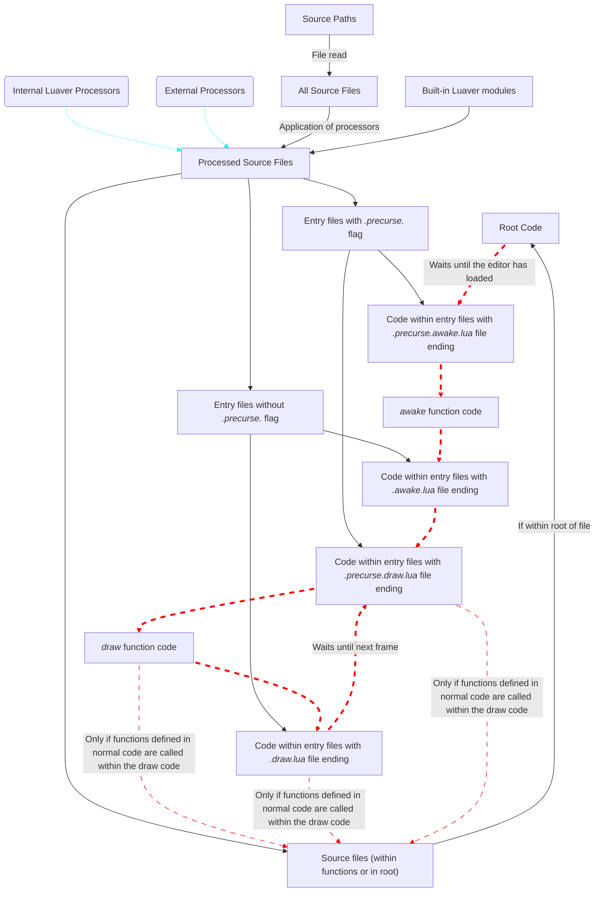

# Luaver

###### Latest Release: August 8, 2026

Luaver is a multifile framework, designed for plugin developers to significantly simplify the creation of large plugins for [Quaver](https://quavergame.com). 

## How to Use
All plugin developers are STRONGLY recommended to use the associated [template](https://github.com/ESV-Sweetplum/Luaver.Template), which provides detailed instructions on how to actually create your own plugin.

If you choose not to use the template, you must clone this repository into the root of the plugin itself. Then, launch the watcher with `node dist/watch`.
You can check the available entry points within the `src` folder.

## Basic Info
> [!IMPORTANT]
> You can skim through this section if you have experience working with Quaver plugins already.

- Typically, Quaver plugins run code through two functions; the `awake()` function, which is ran when the plugin is enabled for the first time (in the given editor session), and the `draw()` function, which runs on every frame.
    - In Luaver, these correspond to the `_awake.lua` and `_draw.lua` files. All code you put inside these files will be treated as awakening/draw code.
- All other code should be run through these two functions; that is, code that should run every frame (for rendering, computation, etc.) should only ever be called within the draw function, or by a function that recursively ends at the draw function.
    - If so desired, you can split the `_draw.lua` file into multiple files by appending a file with the `.draw.lua` extension, which will place the given code at the end of the draw function. If you'd like it to place the code at the beginning, you can use the secondary extension `.precurse.draw.lua`. The same applies for the `_awake.lua` function.
- Aside from the `_draw.lua` and `_awake.lua` files, all other `.lua` files will not have an implicit function header added to them. See the included `plugin` folder for more details.
    - Note that extraneous files with double extensions (`.draw.`, `.awake.`) also do not require a global function header, unless defining a function within the `draw/awake` function itself.

On top of existing Lua syntax, Quaver Lua (which runs on Moonsharp with Lua 5.2) gives some extra globals and syntax that allow the plugin to interact with the map. In short, the following globals (in the form of userdata) are exposed to the plugin:
- `vector`: Provides utilities for vector creation and manipulation.
- `actions`: Provides functions that directly change the map. Requires data provided from `utils`.
- `state`: Provides data about the editor itself.
- `utils`: Provides functions that allows you to transform information into a map-compatible object.
- `map`: Provides functions that gather information about the map.

For more information, visit the [quinsight docs](https://github.com/ESV-Sweetplum/quinsight/blob/main/DOCS.md).

## How It Works
At its simplest, Luaver is simply a file transpiler. It takes all files from a specific source or list of sources (folders) and combines them into one `plugin.lua` file, for Quaver to use.

As mentioned above, all Quaver code is run through the root, the `awake` function, or the `draw` function. Below is a diagram of how your code will end up running in the game, and the order in which your source files are transpiled:


<small>Animated red lines dictate the code's actual control flow, while still arrows show the order in which code is transpiled (line order, not necessarily execution order). Light blue lines show the application of one node on another.</small>

Luaver also provides an intellisense file (courtesy of [quinsight](https://github.com/ESV-Sweetplum/quinsight)), allowing your IDE to get information about all of Quaver's functionality. Some extensions (such as `sumneko.lua` and `JohnnyMorganz.stylua`) are highly recommended.

## Configuration
Luaver uses the current config schema (taken from `src/interfaces/luaverConfig.ts`):
```ts
interface LuaverConfigSchema {
    pluginName: string,
    pluginVersion: string?,
    pluginAuthor: string,
    pluginDescription: string?,
    devVersionInPluginName: boolean?,
    buildVersionInPluginName: boolean?,
    sources: string[],
    outDir: string,
    lineSeparator: '\n' | '\r\n',
    dontRandomizeSeed: boolean?,
    workshopFolder: string?,
    disableDefaultProcessors: boolean?,
    externalProcessors: string[]?,
}
```
Plugin name, version, author, and description are specified in the first four entries of the config.
#### config.VersionInPluginName
Specifies if the `pluginVersion` is appended onto the plugin name in the `settings.ini` file, which changes the name of the plugin in-game.

#### config.Sources
A list of paths that specify which folders Luaver should take `.lua` files from.

#### config.OutDir
Specifies the directory (relative to the root, NOT `Luaver`) in which the output `plugin.lua` gets placed into. Should almost always be `/`.

#### config.LineSeparator
Specifies the line ending used in `plugin.lua`. Should almost always be `\n`, corresponding to LF (no carriage return).

#### config.DontRandomizeSeed
By default, Luaver establishes a true random seed via the `math.randomseed` function. Setting this configuration to `true` removes this. Should almost always be `false`.

#### config.WorkshopFolder
Defines the location of Steam-related assets. If the path is given, the folder should include two files:
- `steam_workshop_id.txt`: The steam workshop id, in a text file. Used for update checking and is only provided when your plugin is uploaded through the game.
- `steam_workshop_preview.png`: A required preview image.

#### config.DisableDefaultProcessors
If `true`, disables the two default processors that save file size and compute time (ipair optimization and unused function linting). Should only be enabled for debugging purposes.

#### config.ExternalProcessors
Similar to `sources`, but provides a list of paths leading to folders with TypeScript-based string processors.

## Support

If you want any custom features or rush orders, check out the link below.

[](https://ko-fi.com/X8X11IU1C3)

To ask for help, or to request anything plugin-related, please join the [Discord](https://discord.gg/gU4P5nPAMF)!
